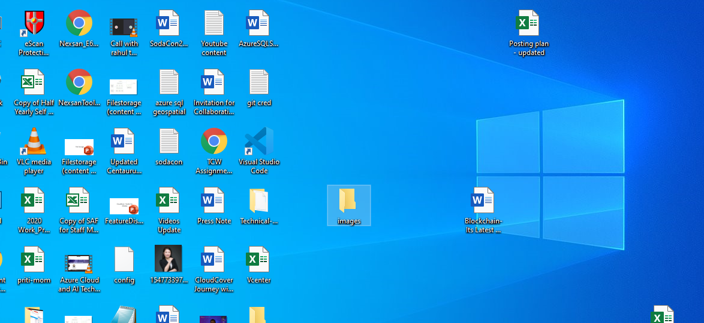

# learning-markdown
# heading 1
## heading 2 content
Learning Markdown
This is my demo file for learning git repo
adding item
1. item 1
2. item 2
i am working on this demo 
# changes by tushar

# changed in tushar branch
adding items in tushar branch
1. item 1
2. item 2

this is my new added item list
1. jeans
2. shoes
3. shirts

<kbd>
  
</kbd>

<kbd>
  
</kbd>

